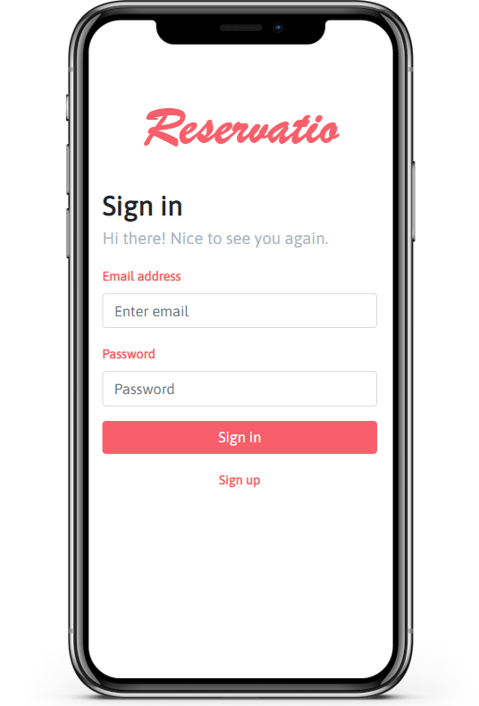

# Reservatio

Application for hairstylists, beauticians and their customers. Online reservations are currently a must-have for every
growing business. Reservatio helps in managing the reservations and reaching more people.

Main features:

* Separate views for customer and service provider
* Searching for a service provider in preferred location
* Scheduling and managing appointments
* Managing employees and services as a service provider
* Review system
* Statistics monitoring
* Responsive for desktop and mobile devices

## Authors

* **Agnieszka Ganowicz**
* **Paweł Cembaluk**
* **Robert Okoński**
* **Adrian Urban**
* **Roman Buszko**
* **Mateusz Gwiżdż**

## Built with

* [JetBrains IntelliJ IDEA](https://www.jetbrains.com/idea/)
* [Spring Boot](https://spring.io/)
* [Hibernate](https://hibernate.org/)
* [React](https://reactjs.org/)
* [MySQL](https://www.mysql.com/)
* [Minio](https://min.io/)
* [Keycloak](https://www.keycloak.org/)

## Screenshots

|  |
|:----------------------------------------:|
|  |
|  |
|  |
|  |
|  |
|  |
